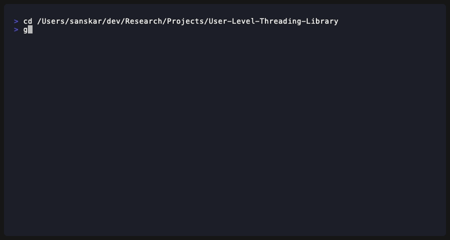
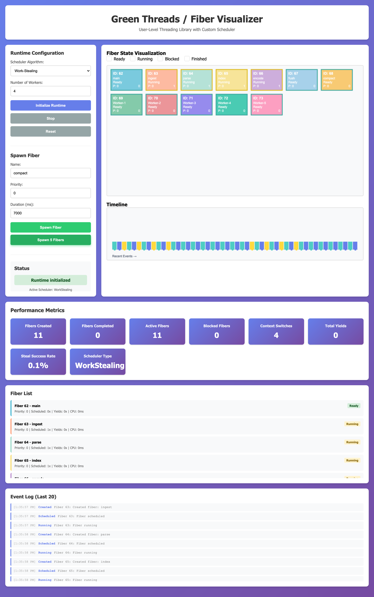
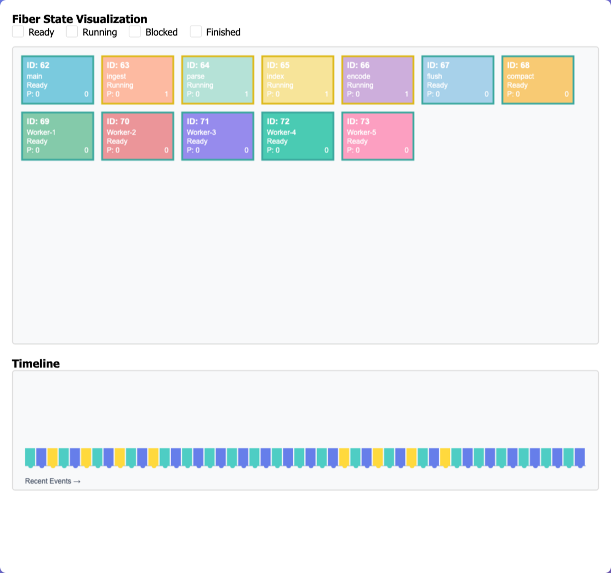
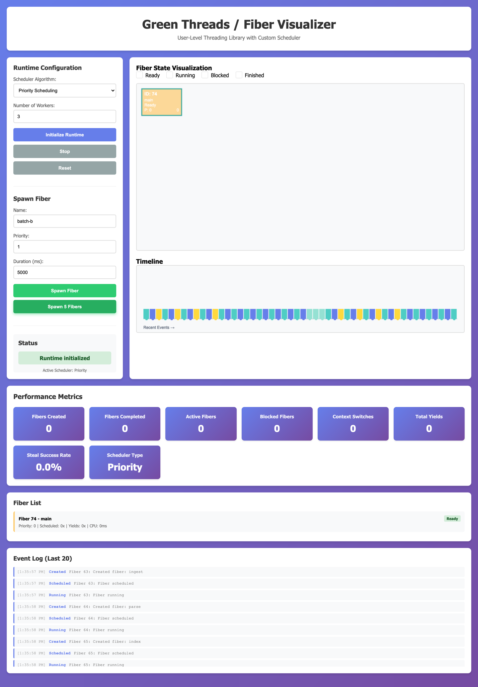
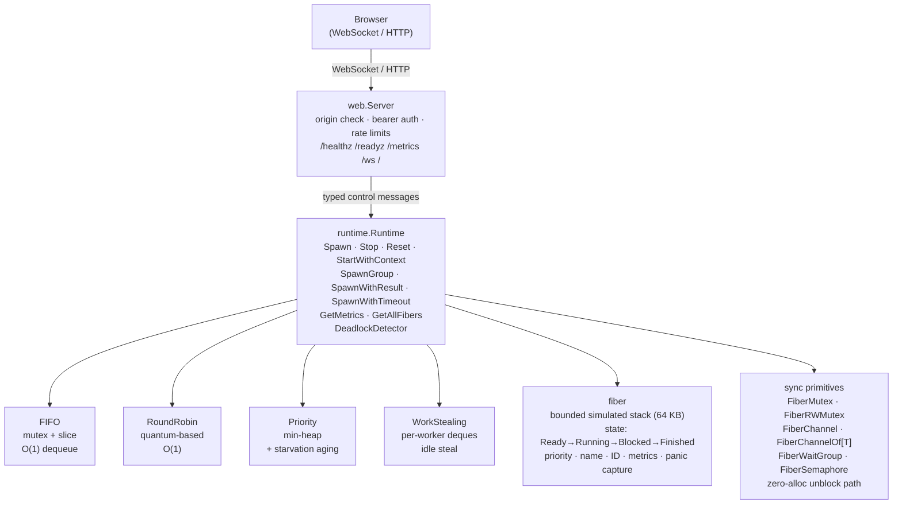

<div align="center">

# greenthreads

**A fiber scheduler for Go with real-time browser observability.**

Four scheduling algorithms. Fiber-aware sync primitives. Deadlock detection.
Prometheus metrics. A live WebSocket control plane — all in a single binary.

---

[](https://github.com/sanskarpan/greenthreads/actions/workflows/ci.yml)
[](https://go.dev/dl/)
[](https://github.com/sanskarpan/greenthreads/actions/workflows/ci.yml)
[](LICENSE)
[](https://securityscorecards.dev/viewer/?uri=github.com/sanskarpan/greenthreads)

</div>

---

## Demo



> A live walkthrough of the browser control plane: initialise a runtime, pick a
> scheduler, spawn fibers, and watch them transition **Ready → Running →
> Finished** across workers while metrics, the event timeline, and the fiber
> list update in real time.
>
> **▶ [Watch the full walkthrough (MP4)](assets/demo.mp4)** &nbsp;·&nbsp; run it
> yourself with `go run ./cmd/server` and open `http://localhost:8080`.

### Screenshots

**Work-stealing scheduler — full dashboard**



**Fiber state visualization & event timeline**



**Priority scheduler — mixed-criticality workload**



---

## Why greenthreads?

Go goroutines are excellent for concurrency, but they give you no control over dispatch order, no structured fan-out with error collection, and no built-in observability beyond `runtime/pprof`. greenthreads adds a thin scheduling layer on top of real goroutines: you choose FIFO, round-robin, priority, or work-stealing dispatch; you get structured `SpawnGroup` fan-out with unified error collection; and a Prometheus endpoint plus a live WebSocket control plane give you real-time visibility into every fiber's lifecycle. The entire stack ships as a single statically linked binary; the core control plane has one runtime dependency (`gorilla/websocket`), with OpenTelemetry pulled in only for opt-in distributed tracing (enabled via `OTEL_EXPORTER_OTLP_ENDPOINT`).

---

## Quick Start

**30 seconds to a running server:**

```bash
git clone https://github.com/sanskarpan/greenthreads
cd greenthreads
go run ./cmd/server
# open http://localhost:8080
```

**Use the scheduler in Go code** (note: packages are currently under `internal/`; a stable `pkg/` public API is planned — see `ISSUES.md`):

```go
import (
    "context"
    "fmt"

    "github.com/sanskarpan/greenthreads/internal/runtime"
    "github.com/sanskarpan/greenthreads/internal/scheduler"
)

func main() {
    rt := runtime.NewRuntime(scheduler.TypeFIFO, 4)
    if err := rt.Start(); err != nil {
        panic(err)
    }
    defer rt.Stop(context.Background())

    id, err := rt.Spawn(func() {
        fmt.Println("hello from fiber")
    }, "greeter")
    if err != nil {
        panic(err)
    }
    fmt.Printf("spawned fiber %d\n", id)
}
```

**Docker:**

```bash
docker build -t greenthreads:local .
docker run --rm -p 8080:8080 \
  -e GREENTHREADS_AUTH_TOKEN='replace-with-a-secret' \
  greenthreads:local
```

---

## Features

| Feature | Status |
|---|---|
| Four scheduler algorithms: FIFO, RoundRobin, Priority, WorkStealing | Stable |
| `Spawn` with name, priority, and timeout | Stable |
| `SpawnGroup` structured fan-out with error collection | Stable |
| `SpawnWithResult` — fiber returning a value via channel | Stable |
| Fiber-aware sync: Mutex, RWMutex, Channel, WaitGroup, Semaphore | Stable |
| Generic typed channel: `FiberChannelOf[T]` | Stable |
| Deadlock detector with configurable interval and timeout | Stable |
| Prometheus metrics: lifecycle counters, context switches, Go runtime stats | Stable |
| Browser WebSocket control plane: spawn, stop, reset, inspect | Stable |
| TLS support via cert/key flags or environment variables | Stable |
| Bearer token auth enforced on non-loopback binds | Stable |
| Same-origin enforcement with configurable allowlist | Stable |
| Optional pprof endpoint (`-pprof-addr`) | Stable |
| Configurable log level via `LOG_LEVEL` | Stable |
| Non-root, statically linked Docker image | Stable |
| Race detector clean; fuzz seeds for all 11 fuzz functions | Stable |

---

## Scheduler Algorithms

| Scheduler | Order guarantee | Best for | Avg dispatch | Starvation risk |
|---|---|---|---|---|
| **FIFO** | Strict arrival order | Predictable pipelines, testing | ~200 ns/op | None |
| **RoundRobin** | Arrival order (see limitations) | Same as FIFO in this release | ~200 ns/op | None |
| **Priority** | Min-heap by priority; anti-starvation aging after 100 pops | Mixed-criticality workloads | ~400 ns/op | Low (aging mitigates) |
| **WorkStealing** | Per-worker FIFO; idle workers steal half from busiest | CPU-bound fan-out, uneven loads | ~350 ns/op | Low |

Benchmark numbers are estimates from CI runs on linux/amd64. They reflect scheduler dispatch overhead only, excluding fiber function runtime. See `scripts/check_benchmarks.sh` for the CI gate threshold.

---

## Architecture



---

## Sync Primitives

| Primitive | Description | Typical use case |
|---|---|---|
| `FiberMutex` | Mutual exclusion lock with fiber-aware wait queue | Protecting shared state accessed by multiple fibers |
| `FiberRWMutex` | Reader/writer lock; multiple concurrent readers | Read-heavy shared state (caches, config) |
| `FiberChannel` | Unbuffered or buffered channel between fibers | Producer/consumer pipelines |
| `FiberChannelOf[T]` | Generic typed wrapper around `FiberChannel` | Type-safe inter-fiber messaging without casts |
| `FiberWaitGroup` | Barrier: wait for N fibers to complete | Fan-out coordination inside the fiber graph |
| `FiberSemaphore` | Counting semaphore limiting concurrent access | Resource pools, rate limiting within fibers |

All blocking operations require an explicit `*fiber.Fiber` argument obtained via `rt.GetFiberDirect(fiberID)` from inside the running fiber. Passing `nil` panics on Lock/Wait and returns an error on Send.

---

## Usage Examples

### Basic spawn

```go
rt := runtime.NewRuntime(scheduler.TypeFIFO, 4)
if err := rt.Start(); err != nil {
    panic(err)
}
defer rt.Stop(context.Background())

id, err := rt.Spawn(func() {
    fmt.Println("hello from fiber")
}, "greeter")
if err != nil {
    fmt.Printf("spawn failed: %v\n", err)
    return
}
fmt.Printf("spawned fiber %d\n", id)
```

### Priority scheduling

```go
rt := runtime.NewRuntimeWithOptions(
    runtime.WithSchedulerType(scheduler.TypePriority),
    runtime.WithNumWorkers(8),
    runtime.WithMaxFibers(1000),
)
if err := rt.Start(); err != nil {
    panic(err)
}
defer rt.Stop(context.Background())

// Higher priority dispatched first.
_, _ = rt.Spawn(func() { criticalTask() }, "critical")   // default priority
// Set priority explicitly via SpawnWithOptions (see runtime API).
```

### SpawnGroup fan-out

```go
sg := rt.NewSpawnGroup()
for i := 0; i < 10; i++ {
    i := i
    sg.Spawn(func() {
        process(i)
    }, fmt.Sprintf("worker-%d", i))
}

// Block until all fibers in the group finish.
errs := sg.Wait()
for _, err := range errs {
    if err != nil {
        fmt.Printf("worker error: %v\n", err)
    }
}
```

### SpawnWithResult

```go
_, ch, err := rt.SpawnWithResult(func() interface{} {
    return computeAnswer()
}, "calculator")
if err != nil {
    panic(err)
}

result := <-ch
fmt.Printf("answer: %v\n", result)
```

---

## WebSocket Control Plane

After `go run ./cmd/server`, open `http://localhost:8080` in a browser. The embedded UI connects to `/ws` and lets you:

- Initialize a new runtime with a chosen scheduler and worker count.
- Spawn named fibers with a priority and simulated duration.
- Stop or reset the runtime.
- Watch every fiber transition through Ready → Running → Blocked → Finished in real time.
- Inspect per-fiber metrics alongside aggregate counters.

The server enforces a limit of **64 concurrent WebSocket clients**, **32 KB max message size**, and **30 messages per client per second**.

### Message types

| Type | Direction | Description |
|---|---|---|
| `init` | client → server | Create a runtime with the given scheduler and worker count |
| `spawn` | client → server | Spawn a named fiber with priority and duration |
| `stop` | client → server | Stop the current runtime |
| `reset` | client → server | Reset runtime state |
| `getState` | client → server | Request a full state snapshot |
| state updates | server → client | Streamed fiber state changes |

### Example messages

```json
{"type": "init", "schedulerType": "priority", "numWorkers": 8}

{"type": "spawn", "name": "worker-1", "priority": 10, "durationMs": 500}

{"type": "stop"}

{"type": "reset"}

{"type": "getState"}
```

Invalid messages return a generic error response and do not expose internal details.

---

## HTTP API

| Endpoint | Method | Auth required | Description |
|---|---|---|---|
| `/healthz` | GET | No | Process liveness. Returns 200 while the server is running. |
| `/readyz` | GET | No | Runtime readiness. Returns 200 when a runtime is active, 503 otherwise. |
| `/metrics` | GET | On non-loopback | Prometheus text exposition. Go runtime stats included. |
| `/ws` | GET | On non-loopback | WebSocket upgrade to the control plane. |
| `/` | GET | No | Embedded browser visualization UI. |

---

## Configuration

| Flag / Environment variable | Default | Description |
|---|---|---|
| `-listen` | `127.0.0.1:8080` | Explicit bind address. Non-loopback binds require `GREENTHREADS_AUTH_TOKEN`. |
| `-port` | `8080` | Port used when `-listen` is omitted. Valid range: 1–65535. |
| `GREENTHREADS_AUTH_TOKEN` | _(empty)_ | Bearer token required for non-loopback binds. Prefer `Authorization: Bearer <token>` header over `?token=` query param to avoid token leakage in logs. |
| `-tls-cert` / `GREENTHREADS_TLS_CERT` | _(empty)_ | Path to TLS certificate PEM. Both cert and key must be set to enable TLS. |
| `-tls-key` / `GREENTHREADS_TLS_KEY` | _(empty)_ | Path to TLS private key PEM. |
| `-pprof-addr` | _(empty)_ | Address for the optional pprof HTTP endpoint (e.g., `localhost:6060`). |
| `LOG_LEVEL` | `INFO` | Log verbosity. One of: `DEBUG`, `INFO`, `WARN`, `ERROR`. |

WebSocket limits: 64 clients, 32 KiB messages, 30 messages/client/second, 10 000 max active fibers per runtime. These are compile-time constants in `web/server.go`.

Use `NewServerWithConfig` to override limits and the origin allowlist when embedding the server in another application.

---

## Performance

Benchmarks run on every CI push via `make bench`. The CI gate (`scripts/check_benchmarks.sh`) fails if the FIFO scheduler exceeds 500 000 ns/op. Numbers below are representative estimates from linux/amd64 CI runs and reflect scheduler dispatch overhead only.

| Scheduler | Dispatch (ns/op) | Allocs/op |
|---|---|---|
| FIFO | ~200 | 0 |
| RoundRobin | ~200 | 0 |
| WorkStealing | ~350 | 0 |
| Priority | ~400 | 0 |

The zero-alloc unblock path in the sync package and in-place fiber compaction (`filterFinished`) keep GC pressure low under high spawn rates.

---

## Known Limitations

### 1. Deadlock when all worker slots block

greenthreads dispatches one goroutine per fiber, up to `numWorkers` concurrent fibers. A fiber that blocks on a sync primitive (`FiberMutex.Lock`, `FiberChannel.Receive`, `FiberWaitGroup.Wait`) holds its worker slot until it returns.

**If all `numWorkers` slots are occupied by fibers waiting on work from fibers that have not yet been dispatched, the runtime hard-deadlocks with no recovery path.** The deadlock detector will surface this condition but cannot break the cycle.

**Rule:** ensure `numWorkers > max_simultaneously_blocked_fibers`. For a 1-producer + 4-consumer pattern, use at least 6 workers.

### 2. RoundRobin behaves identically to FIFO

`TypeRoundRobin` does not preempt fibers after their quantum. Preemptive scheduling requires cooperative yield, which is not implemented in this release. If you need round-robin dispatch, use `TypeFIFO` until preemption is available.

### 3. No stackful context switching

Each fiber is a real Go goroutine. A `time.Sleep` or blocking system call inside a fiber holds its goroutine and its worker slot for the full duration. There is no cooperative yield that releases the slot to other waiting fibers.

### 4. Priority starvation without aging

Under constant high-priority spawns, lower-priority fibers may be indefinitely deferred. The scheduler boosts waiting fibers automatically after 100 heap pops (anti-starvation aging), but under extreme imbalance, explicitly calling `scheduler.(*PriorityScheduler).AgeAll()` provides immediate relief.

---

## Documentation

| Document | Contents |
|---|---|
| [RUNBOOK.md](RUNBOOK.md) | Deployment, health checks, rollback, and failure diagnosis |
| [CHANGELOG.md](CHANGELOG.md) | Version history and bug fixes |
| [CONTRIBUTING.md](CONTRIBUTING.md) | Development workflow, standards, and required checks |
| [docs/ARCHITECTURE.md](docs/ARCHITECTURE.md) | Internal design, package map, and flow diagrams |
| [docs/adr/](docs/adr/) | Architecture Decision Records |
| [SECURITY.md](SECURITY.md) | Vulnerability disclosure policy |
| [ISSUES.md](ISSUES.md) | Open issues and tracked limitations |

---

## Contributing

Contributions are welcome. Before opening a pull request:

1. **Branch naming**: `feature/<short-name>`, `fix/<short-name>`, or `chore/<short-name>`.
2. **Commit convention**: [Conventional Commits](https://www.conventionalcommits.org/) — e.g., `fix: preserve unbuffered channel values on reset`.
3. **Required checks** (all must pass):
   - `go build ./...`
   - `go test ./...`
   - `go test -race ./...`
   - `go vet ./...`
   - `golangci-lint run ./...`
   - `make coverage COVERAGE_MIN=45`
   - `make bench`
   - `govulncheck ./...`
   - container scan (Trivy, runs in CI)
4. **Pull request contents**: regression test, risk summary, and verification output showing the checks above.
5. Keep public contracts and documented operational limits up to date when behavior changes.

See [CONTRIBUTING.md](CONTRIBUTING.md) for the full guide.

---

## License

MIT. See [LICENSE](LICENSE).
